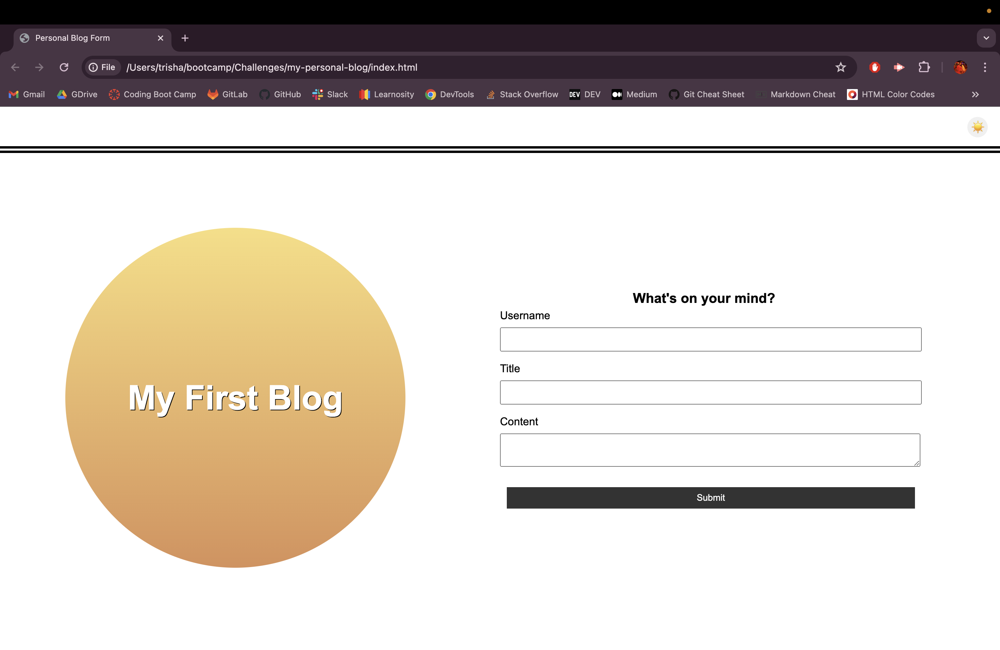

# 📓 A Personal Blog for Marketing Students

## ✏️ Description

Welcome to a Personal Blog for Marketing Students! This is a dedicated platform tailored for marketing enthusiasts to exhibit their expertise, experiences, and reflections within the dynamic realm of marketing. It serves as a hub for sharing valuable insights, innovative projects, and personal reflections with peers, mentors, and prospective employers.

It is tailored to have these main features:

1. Form Page - A page to input a username, blog title, and blog content will be given.
2. Blog Post Display - A list of blog posts containing multiple inputs from one or more users will be presented.

## ✏️ Installation and Usage

📌 To run the Personal Blog for Marketing Students, you can do either of the following:

* Use the link:
  
  [Personal Blog for Marketing Students](https://trishamasbate.github.io/my-personal-blog/)

* Clone the repository:
```
git clone git@github.com:trishamasbate/my-personal-blog.git
```

📌 Click on the "Submit" button to send and store inputs for:

1. Username
2. Title
3. Content

📌 This code is structured to also feature the following on the pages:

- Local Storage Blog Post Storage:
   - Upon form submission, stores the blog post data (including username, title, and content) in the browser's local storage.

- Redirection to Posts Page:
  - After successful form submission, redirects the user to the posts page.

- Form Validation Prompt:
  - Displays a message prompting the user to complete the form if they attempt to submit it without entering a username, title, or content.

- Light Mode/Dark Mode Toggle.
  - Enables users to switch between light mode and dark mode by clicking the toggle.

- "Back" Button.
  - Implements functionality for the "Back" button to redirect users back to the landing page for inputting more blog entries.

- Local Storage JSON Array:
  - Provides users with the ability to view the stored blog post data in the form of a JSON array.

- Footer with Developer's Portfolio Link:
  - Provides a link within the footer that directs users to the developer's portfolio.


📌 Here is a preview showing the functionality of the Marketing Student Personal Blog: [Personal Blog for Marketing Students Workaround](https://youtu.be/pdmJflMeGmQ)





## ✏️ Credits

Credits to the following:

- Classmates
- TA and Instructors
- [Stack Overflow](https://stackoverflow.com/?newreg=f63e9ea2d90e48e6b29cd0118dd59f99)
    - [Styling](https://cssgradient.io/)
- [MDN Web Docs](https://developer.mozilla.org/en-US/)
    - [While Loop](https://developer.mozilla.org/en-US/docs/Web/JavaScript/Reference/Statements/while)
    - [Return Statement](https://developer.mozilla.org/en-US/docs/Web/JavaScript/Reference/Statements/return)


## ✏️ License

This project is licensed under the [MIT License](https://opensource.org/licenses/MIT).


## ✏️ Contributing

If you have any ideas, suggestions, or bug reports, please feel free to open an issue or submit a pull request. Thank you so much! 💕